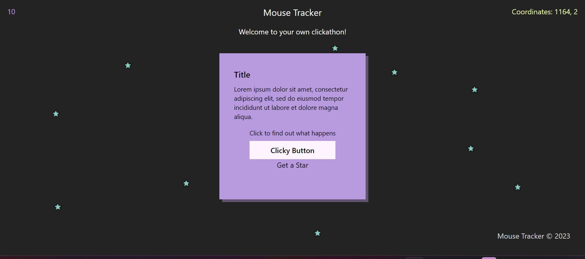

# Mouse Tracker x Testing

A collaboration between Therese Johansson and Ida Mäkelä

## The application

This application is a small SPA that displays different UI elemnts depending on where the user clicks or move the mouse.

## Acceptance criterias

-   App
    -   Coordinates from the mouse(onMouseMove) on the screen.
    -   Header, Footer and Card components.
-   Header

    -   Cointains title and subtitle for the page and a count of how many times the user has clicked the button component "GetAStar"

-   Main

    -   Render main element.

-   Card

    -   Title
    -   Information Text
    -   Result Box
    -   Get A Star button
    -   Clicky Button

-   ClickyButton

    -   Result for ClickyButton event.
    -   Button with a fireevent.

-   Footer
    -   Footer text

## Project Overview

### Components

#### 1. **Header Component (Header.jsx)**

-   This component represents the header of the web application.

#### 2. **Footer Component (Footer.jsx)**

-   The footer component.

#### 3. **Card Component (Card.jsx)**

-   Represents a card-like section within the application.
-   Contains a title and information text.
-   Includes two buttons labeled 'Get a Star' and 'Clicky button'.

#### 4. **ClickyButton Component (ClickyButton.jsx)**

-   A button component, inferred from the 'Clicky button' button within the Card component.

#### 5. **MouseTracker Component (MouseTracker.jsx)**

-   Tracks mouse movements and displays the X and Y coordinates.

##

## Feedback from the developers, Paola and Freddie

This was a fun project to build from just looking at the test! Here are some things that can be improved.

A unit test should test one component in isolation. Any integration tests using App should be made in the app.test.js file. Both header.test.js and card.test.js does this. Card for example has a test using app that could be replaced by card. In header there's an integration test that should be moved to app.test.js.

Also in card.test.js there's a mention of a function name, handleShowImage, that is not in any actual tests. The tests should be written with the user in mind and regarding what is showing up on screen.

The integration tests for App regarding the star images should've included some test for the functionality that produces more stars. As it is written now it only tests whether or not one single star is shown on screen after a button is clicked. This would've also been helpful for us when we were developing the site. It was also unclear if the clicky button should've added a star or not since there was no test for that.
